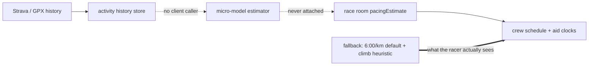

# Pacing accuracy program

**Goal:** a racer uploads their history (Strava or manual GPX) and gets an accurate prediction of their finish time and their arrival time at every aid station.

This doc exists so a successor agent can execute the remaining work without re-deriving the diagnosis. Read it after `agent-handoff.md` and `token-budget.md`.

---

## The diagnosis, and its evidence

**Uploaded history has never influenced any number a racer sees.** This was verified against the deployed Railway database, not inferred:

| Check | Result |
| --- | --- |
| `pacingEstimateId` on race rooms | NULL on all rooms, including both `TMR 100k` rooms and `John Cappis 50k` |
| `SELECT count(*) FROM pacing_estimate_json` | 0 |
| `rg -l "pacing-estimates" --glob '!services/api/**'` | no matches anywhere outside the API |
| In-app PACE badge | 9:39/mi, exactly `formatPace(360, "mi")` |

Stored `plannedPaceSecondsPerKm` values were `360` and `359.99999999999994`. That float artifact is the round-trip signature of the no-timestamp fallback: `deriveTimingFromPoints` multiplies distance by `DEFAULT_PACE_SECONDS_PER_KM`, then `finishParsedGpxTrack` divides by the same distance. Planned course GPX has no timestamps, so this always fires.

So the real data flow is not the intended one:

Two athletes of very different fitness get identical predictions on the same course.

### Corollary: the #475 calibration was misattributed

`CONSTANTS_FOR_APPROVAL.md` recorded "first aid ~44 min late" and blamed the micro-model for treating history mean pace as flat GAP and then re-applying Minetti-style hills. The micro-model was not running, so that cannot be the cause. #475 responded by softening `M(g)` **and** dropping `GRADE_COST_BLEND_HISTORY` to 0.22, meaning both constants were fitted to an error from a different code path. The note is retracted and its approval checkbox re-opened; the constants still need reverting.

---

## Sequencing principle

Wire the estimator to a client **before** tuning the model. Tuning a path nobody reaches produces no measurable improvement, and #475 is a concrete example of what goes wrong. Validate once at the end of the sequence, not per step.

---

## Completed

### #478 — fallback climb penalty (merged/open as PR #479)

`buildPlanBaselineFromModel` charged 8 s per meter of gain, roughly double a defensible running value. Now `DEFAULT_GAIN_PENALTY_SECONDS_PER_METER = 3.6` (one hour per 1000 m).

Measured on `fixtures/pacing/course-50k-with-aids.gpx`, a flat 50 km with 348 m gain: horizontal 4.99 h, penalty 0.77 h at 8 s/m versus 0.35 h at 3.6 s/m. On a 3000 m 100k it is the difference between 6.7 h and 3.0 h of climb penalty. This was the dominant error in every schedule produced so far.

---

## Remaining work

### PR A — connect history to the race plan (mobile)

The accuracy work is worthless until this exists. `apps/mobile/src/api/client.ts` has history upload and schedule read, but no estimator call.

- Add `createPacingEstimate` (POST `/pacing-estimates` with `roomId`) and `attachPacingEstimate`. Network calls must live only in that file; `scripts/verify-dual-client-architecture.mjs` enforces it. The guard does not require web parity, so skip `apps/web` this pass.
- Trigger after course save when the athlete has history, plus an explicit "Recalculate from my history" action. Reuse `ColdStartEstimatePanel`, which already renders the cold-start prompt and CTA.
- Surface `estimate.explanation` and `coldStart` so the racer can tell whether their history was used.

**Trap 1 — attach by id, never inline.** In `services/api/src/routes/raceRoomSchedule.ts` (~447-459), only the `pacingEstimateId` path carries `storedBaseline` into `course.baselineTrack`. Passing an inline `estimate` body for a first-time estimate leaves `storedBaseline` undefined, so the course keeps the old heuristic curve and the map and Pace screens silently disagree with the schedule. Correct order: POST `/pacing-estimates` (which saves the baseline), then attach by the returned id.

**Trap 2 — derive `plannedPaceSecondsPerKm` from the estimate.** Attaching does not touch it, so it stays 360. It still drives the PACE badge, the `rollingMovingSpeedMps` seed in `recomputeRaceProjection`, the non-baseline ETA branch, and `frozenElapsedAt` in live remaining. Without this the badge keeps reading 9:39 next to corrected aid times.

Acceptance:

- Schedule response carries `pacingEstimateId` after the action.
- `course.baselineTrack` is the micro-model curve, so schedule, map, and Pace clocks agree.
- Two athletes with materially different history produce different aid clocks on the same course.
- No history yields the cold-start estimate plus prompt, never a silent 6:00/km.

Mobile UI, so simulator proof is required per `.cursor/rules/mobile-simulator-agent-qa.mdc`. Auth0 is a known unattended-sim blocker (#333); if it blocks, stop and report what was verified plus options. Do not fake a pass.

### PR B — backtest harness (no behavior change)

Without this, every tuning cycle costs a real race. This is what makes PR C measurable.

- Script under `scripts/` plus fixtures in `fixtures/pacing/`: given `ActivityHistoryRef` rows, a course GPX, and the athlete's **actual** splits, print predicted versus actual elapsed per aid and at the finish, with signed error and mean absolute error.
- Call `estimatePacingMicroModelWithArtifacts` directly. No HTTP, no network, deterministic.
- Seed from real completed efforts. Railway is the source of real data, not local Postgres.

### PR C — one coherent model change

Do these together; they interact, and splitting them produces uninterpretable results.

**C1. Bulk GAP from summary elevation.** `runnerProfile.ts` uses history mean pace directly as baseline GAP and never reads `elevationGainMeters`, though `packages/contracts/src/pacingSchedule.ts` already stores it. Deriving a flat-equivalent pace from distance plus gain is simpler and less noise-prone than per-point GAP from raw tracks, which suffers convexity bias under GPS elevation noise and haversine-versus-geodesic distance asymmetry (both bias the athlete faster).

*Verify first:* `buildDerivedMetricsFromPolyline` computes gain via `gainLossFromSmoothed` with a **per-vertex** 3 m threshold, which likely understates gain on dense tracks. Check a known course and a known Strava activity against published figures before relying on stored `elevationGainMeters`.

**C2. Riegel endurance scaling.** No endurance term exists today. Fatigue yields roughly 29% decay at a 100-mile finish and almost all of it comes from the descent term, so a flat 100-miler decays only about 5%. A runner whose 20 km GAP is 5:30/km needs roughly a 1.5x factor at 100 miles, not 1.15x. Use `T2 = T1 x (D2/D1)^k`.

**C3. Renormalize fatigue to shape-only.** GAP from a 20 km run already contains that run's fatigue, and race fatigue is then applied from zero, so it double-counts. Redistribute the endurance-scaled total across the course rather than adding to it, so endurance, gamma, and `M(g)` stay orthogonal.

**C4. Un-bend #475.** Set `GRADE_COST_BLEND_HISTORY` to 1.0 and restore a physiological cost curve. Today the softened `M(g)` (`1 + 1.5g + 3.5g^2 + 6g^3`) plus blend 0.22 make a 10% grade cost about +4%, which is nearly free. Raising the blend alone would trade early-race pessimism for big-vert optimism, which is why C4 must ship with C1. Re-derive from the PR B harness and re-approve `CONSTANTS_FOR_APPROVAL.md`.

### PR D — aid station dwell

`DEFAULT_CHECKPOINT_PLANNED_STOP_SECONDS` is 600 s. Across many checkpoints that flat default can exceed the pace error it sits next to, and `selectAidCheckpoints` falls back to every mid-course checkpoint. Make dwell realistic and editable, tighten the fallback, and split moving time from dwell on the schedule row so the racer can see which is which.

---

## Known traps and open risks

- **Per-vertex elevation thresholds are not interchangeable with per-run ones.** Do not copy `minimumDeltaMeters` from `gainLossFromSmoothed` into `buildPlanBaselineFromModel`. On a dense GPX with ~10 m spacing, a 3 m rise implies a 30% grade, so it would discard nearly all legitimate climbing. Real noise rejection needs hysteresis over monotonic runs, and should only ship once PR B can measure it.
- **Determinism.** `listActivityHistoryForAthlete` returns all history, so predictions shift after any Strava sync. Enrich-on-replay can also mutate stored GAP. Both need pinning before predictions are treated as stable.
- **Tests that assert only direction.** The 8 s/m constant survived because baseline coverage asserted monotonicity, which any positive penalty satisfies. Pin magnitudes, and recompute expectations from the same inputs the code uses rather than blessing golden numbers.
- **Local `vite build`.** If it fails on a missing `@rolldown/binding-darwin-arm64`, that is the npm optional-dependency arch bug, not a regression. Fix with `rm -rf node_modules && npm ci`; keep the lockfile, which is already correct.

## Deferred

Live race-day remaining-pace correction, per-activity track storage, per-athlete slope efficiency `E(g)`, and heat/darkness/surface factors. Each needs its own issue; none is required for the stated goal.

## Validation policy

Run `npm run verify` per PR. Do a single field validation only after PR D, comparing against the PR B backtest table. Intermediate field validation is explicitly not wanted.
